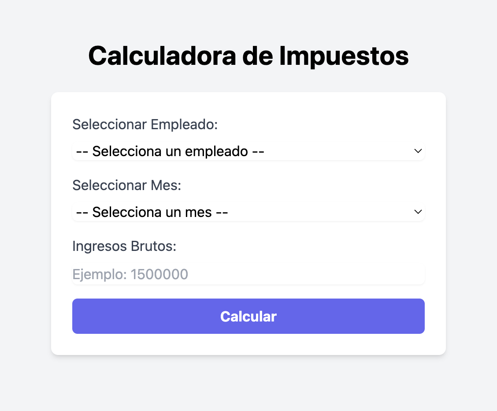
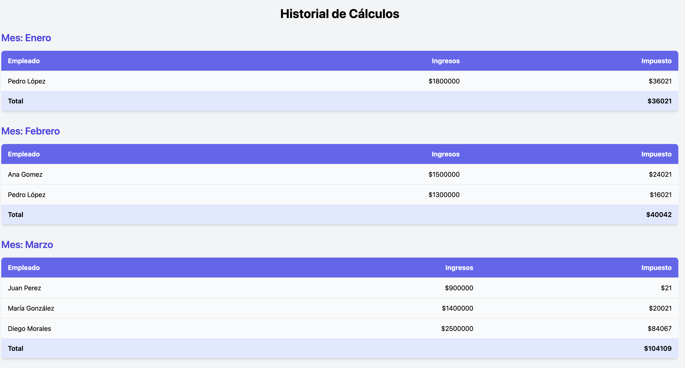

# Calculadora de Impuestos

La **Calculadora de Impuestos** es una aplicación web diseñada para calcular y registrar deducciones de impuestos basadas en las leyes chilenas. Permite a los usuarios ingresar información de empleados, ingresos y meses específicos, y calcula automáticamente los impuestos aplicables. Además, ofrece un historial de deducciones y una interfaz modular, intuitiva y validada.

## Características

- **Ingreso de Datos**: Selección de empleados, meses y entrada de ingresos brutos.
- **Cálculo Automático de Impuestos**: Basado en las reglas fiscales chilenas.
- **Validación de Datos**: Asegura la entrada correcta de datos y evita duplicados.
- **Historial de Deducciones**: Visualización de deducciones organizadas por mes.
- **Mensajes de Feedback**: Notificaciones visuales para errores y resultados exitosos.
- **Modularidad**: Componentes React reutilizables y mantenibles.
- **Persistencia en la Nube**: Almacenamiento de datos con Firebase Firestore.

---

## Tecnologías Utilizadas

- **Frontend**: React + TypeScript
- **Backend**: Firebase Firestore
- **Estilos**: Tailwind CSS
- **Librerías Adicionales**:
  - `react-toastify`: Para notificaciones.
  - `mermaid`: Para renderizar diagramas.
  - `react-router-dom`: Manejo de rutas.

---

## Instalación

Sigue estos pasos para instalar y ejecutar el proyecto localmente:

1. **Clona el repositorio**:
  ```bash
   git clone https://github.com/JonaDrar/taxCalculator
   cd tax-calculator
  ```

2. **Instala las dependencias**:
  ```bash
   npm install
  ```

3. **Configura Firebase**:
   - Crea un proyecto en [Firebase Console](https://console.firebase.google.com).
   - Habilita Firestore y agrega las credenciales en un archivo `.env`:
    ```bash
     VITE_REACT_APP_API_KEY=<TU_API_KEY>
     VITE_REACT_APP_AUTH_DOMAIN=<TU_AUTH_DOMAIN>
     VITE_REACT_APP_PROJECT_ID=<TU_PROJECT_ID>
     VITE_REACT_APP_STORAGE_BUCKET=<TU_STORAGE_BUCKET>
     VITE_REACT_APP_MESSAGING_SENDER_ID=<TU_MESSAGING_SENDER_ID>
     VITE_REACT_APP_APP_ID=<TU_APP_ID>
    ```

4. **Ejecuta la aplicación**:
  ```bash
   npm run dev
  ```

5. **Abre la aplicación**:
   - Ve a [http://localhost:5173](http://localhost:5173) en tu navegador.

---

## Estructura del Proyecto
```bash
.
├── src
│   ├── components
│   │   ├── TaxCalculator.tsx       # Componente principal para calcular impuestos
│   │   ├── History.tsx             # Componente para mostrar el historial
│   │   ├── SequenceDiagram.tsx     # Componente del diagrama de secuencia
│   │   └── Loader.tsx              # Componente de carga
│   ├── firebase
│   │   └── firebaseConfig.ts       # Configuración de Firebase
│   ├── hooks
│   │   └── useInputValidation.ts   # Hook para validar entradas
│   ├── styles                      # Estilos globales
│   ├── App.tsx                     # Configuración de rutas
│   └── main.tsx                    # Punto de entrada principal
├── public
│   ├── favicon.svg                 # Ícono del proyecto
├── .env.example                    # Ejemplo de archivo de configuración
├── README.md                       # Este archivo
├── vite.config.ts                  # Configuración de Vite
```

---

## Uso

### 1. **Ingreso de Datos**
- Selecciona un empleado, un mes, e ingresa los ingresos brutos.
- Presiona el botón para calcular el impuesto.

### 2. **Historial**
- Accede al historial desde la pestaña correspondiente.
- Observa las deducciones agrupadas por mes.

### 3. **Diagramas**
- Consulta el flujo del sistema en la página de diagramas.

---

## Capturas de Pantalla

### Calculadora


### Historial


---

## Licencia

Este proyecto está licenciado bajo la [MIT License](LICENSE).

---

## Contribuciones

¡Las contribuciones son bienvenidas! Si deseas colaborar:
1. Crea un fork del repositorio.
2. Realiza los cambios en una nueva rama:
   git checkout -b feature/nueva-funcionalidad
3. Realiza un pull request.

---

## Contacto

Si tienes preguntas o sugerencias, no dudes en contactarnos:
- **Autor:** Jonathan Araya
- **Correo:** j.arayarobles@gmail.com

---